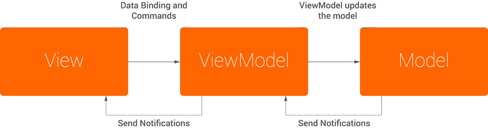

 

## What is MVVM?

[Vue.js](https://kr.vuejs.org/) 를 시작하면서 MVVM 아키텍처 패턴에 대해 알아보기 시작했다.

MVVM 은 Model View View-Model 의 약어이며 Model 과 View 는 MVC 패턴에서 사용되는 개념과 동일하다.

View Model 을 한마디로 표현하자면 <red>*View Model 은 View 를 추상화 한 것이다.*</red>

<gray>다음은 MVVM 패턴이 동작하는 원리에 대한 그림이다.</gray>

 

 

*이 중 View Model 이 가지고 있는 몇가지 특징들을 함께 살펴보자.*

 

### View State

View Model 은 View 를 추상화하기 위해 추상화된 View 의 상태(ViewState) 를 유지한다.

예를 들면 사용자의 입력을 받는 html 의 input 태그에 대한 추상화이다.

사용자 로그인으로 예시를 들어보자, email 과 password 를 입력하는 두개의 input 이 존재한다.

View Model 은 email 과 password 두 input 을 추상화하여 가지고 있는다.

그리고 해당 인풋들과 View Model 간의 data binding 을 한다. 이를 통해 View Model 의 상태가 변경되면 input 의 값을 변화시킨다.

반대로 input 의 값이 변화되면 View Model 의 상태도 변경이 된다.

Vue.js 에서는 [v-model directive](https://vuejs.org/v2/guide/forms.html) 를 통한 양방향 바인딩이 그 예시가 될 수 있겠다.

 

### Value Converters

View 와 Model 간 data 전송 시 raw data 가 그대로 사용되기도 하지만 그렇지 않은 경우도 존재한다.

Database 에서 그대로 전달된 timestamp 는 사용자에게 아무 의미없는 숫자로 보여질 것이다.

위의 경우와 같이 View 에게 data 가 전달되기 전 변환작업을 거친 후 사용자에게 전달이 되는데 이 때 사용되는 도구가 Value Converter 이다.

 

### Commands

View Model 은 사용자가 어플리케이션에서 View Model 에 명령을 내리는 수단을 제공해야 한다.

그리고 해당 기능들을 추상화 하기 위해 Commands 를 가져야 한다.

사용자 로그인으로 예시를 들어보자, 사용자가 email 과 password 를 input 에 입력하고 View Model 은 상태값이 바뀌어 있다.

사용자가 login 버튼을 누르면 View Model 은 사용자 입력값과 함께 Model 에 접근할 것이다.

해당 사용자가 어플리케이션의 유저가 맞는지 확인하고 사용자에게 특정 응답을 줄 것이다.

여기서 login 버튼을 누르는 행위가 Commands 를 실행하는 것이다.

 

## Why MVVM?

MVVM 패턴은 재사용성이 뛰어나고 테스트에 용이하다.

View Model 의 핵심은 추상화이다. 구체화 하지 않기 때문에 View Model 은 View 에 대해 알지못한다.

<red>이는 View Model 이 어플리케이션에 의존성을 띄고있지 않음을 의미한다.</red>

다시 말해 독립적이고 재사용 가능한 인스턴스를 새로 생성할 수 있으며 해당 View Model 을 다른 어플리케이션에 적용할 수 있다는 것이다.

또 어플리케이션 레벨에서 테스트를 하지 않고 View Model 인스턴스를 테스트 하기만 되는 편리함이 있다.

그로인해 해당 View Model 을 사용하는 어플리케이션들의 테스트를 간소화 할 수 있다는 장점이 존재한다.
