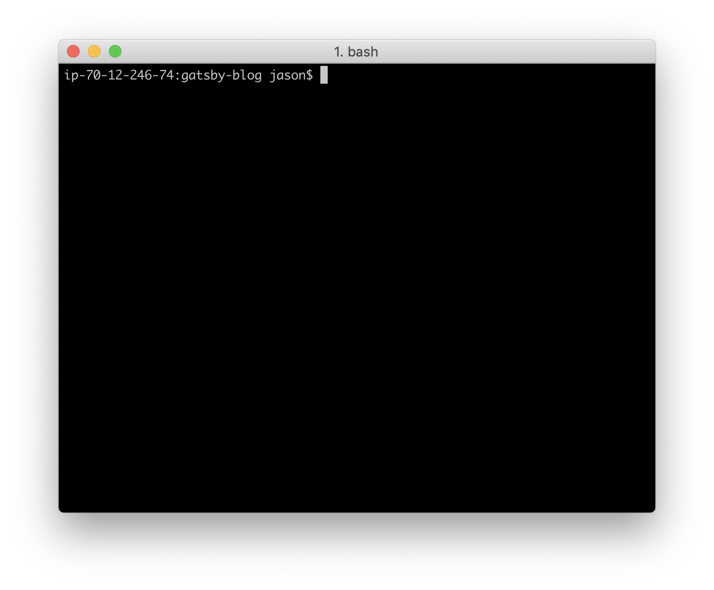
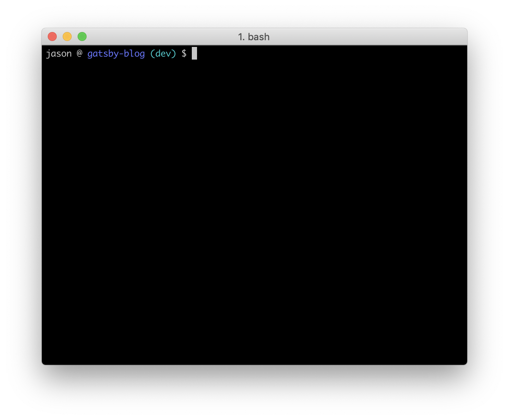

<br />

## Terminal 에서 git branch 보이게 하기

```bash
echo -e "parse_git_branch() {\ngit branch 2> /dev/null | sed -e '/^[^*]/d' -e 's/* \(.*\)/ (\1)/'\n}\nexport PS1=\"\u @ \[\e[94m\]\W\[\e[36m\]\$(parse_git_branch) \[\e[m\]$ \"" >> ~/.bash_profile # or .bashrc

source ~/.bash_profile # or .bashrc
```

### Before



### After

